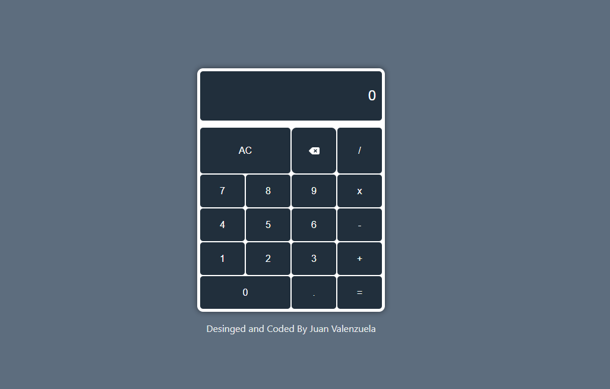

# CALCULADORA - REACT

Este es un proyecto de calculadora construido con React y Vite. La calculadora permite realizar operaciones matemáticas básicas. Este proyecto me ha permitido mejorar mis conocimientos en react al implementar las siguientes descritas a continuación.

## Características

- Realiza operaciones matemáticas básicas: suma, resta, multiplicación y división.
- Interfaz de usuario sencilla y clara.
- Compatible con entradas de teclado y clics de botones.

## Tecnologías Utilizadas

- **Frontend:** HTML5, CSS3, JavaScript ES6, React y Vite.
- **Librerías:** Google Fonts, Font Awesome.

## Autor

- Juan Valenzuela
- https://github.com/Juan-Valenzuela3
- https://www.linkedin.com/in/juan-valenzuela-camelo

## Licencia

- Este proyecto está licenciado bajo la [Licencia MIT](./LICENSE).

